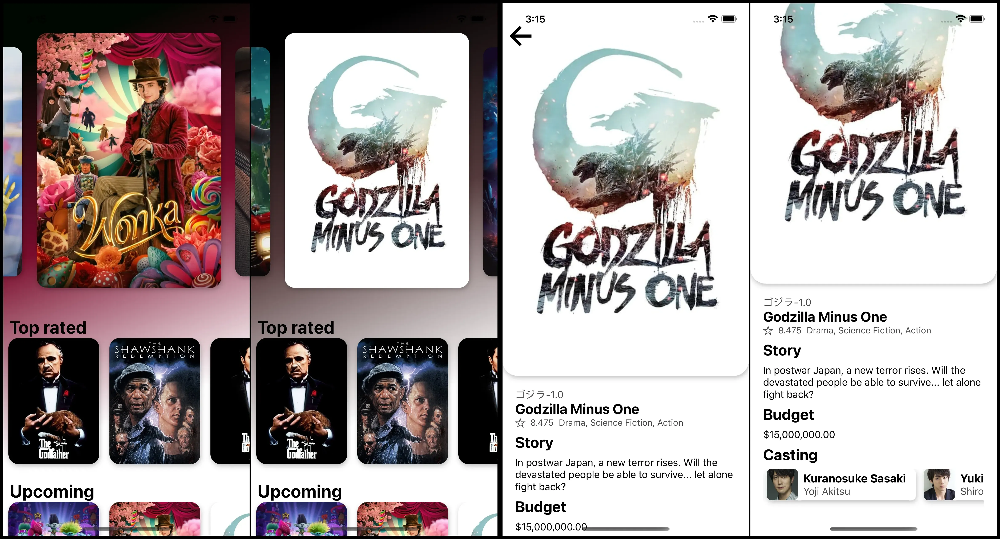

# Movies App

The objective of this application is purely practical, specifically focusing on:

- Axios
- Custom Hooks applied to reality
- Loadings
- Simultaneous promises
- Carousels
- StackNavigator

## Demo



## Prerequisites

- [Node.js > 16](https://nodejs.org) and npm (Recommended: Use [nvm](https://github.com/nvm-sh/nvm))
- [Watchman](https://facebook.github.io/watchman)
- [Xcode 12](https://developer.apple.com/xcode)
- [Cocoapods 1.10.1](https://cocoapods.org)
- [JDK > 11](https://www.oracle.com/java/technologies/javase-jdk11-downloads.html)
- [Android Studio and Android SDK](https://developer.android.com/studio)

## Base dependencies

- [axios](https://github.com/axios/axios) for networking.
- [react-navigation](https://reactnavigation.org/) navigation library.
- [react-native-snap-carousel](https://github.com/meliorence/react-native-snap-carousel) swiper/carousel component for React Native.
- [react-native-vector-icons](https://github.com/oblador/react-native-vector-icons) customizable Icons for React Native.

## Step 1: Start the Metro Server

First, you will need to start **Metro**, the JavaScript _bundler_ that ships _with_ React Native.

To start Metro, run the following command from the _root_ of your React Native project:

```bash
# using npm
npm start

# OR using Yarn
yarn start
```

## Step 2: Start your Application

Let Metro Bundler run in its _own_ terminal. Open a _new_ terminal from the _root_ of your React Native project. Run the following command to start your _Android_ or _iOS_ app:

### For Android

```bash
# using npm
npm run android

# OR using Yarn
yarn android
```

### For iOS

```bash
# using npm
npm run ios

# OR using Yarn
yarn ios
```

If everything is set up _correctly_, you should see your new app running in your _Android Emulator_ or _iOS Simulator_ shortly provided you have set up your emulator/simulator correctly.

This is one way to run your app — you can also run it directly from within Android Studio and Xcode respectively.
